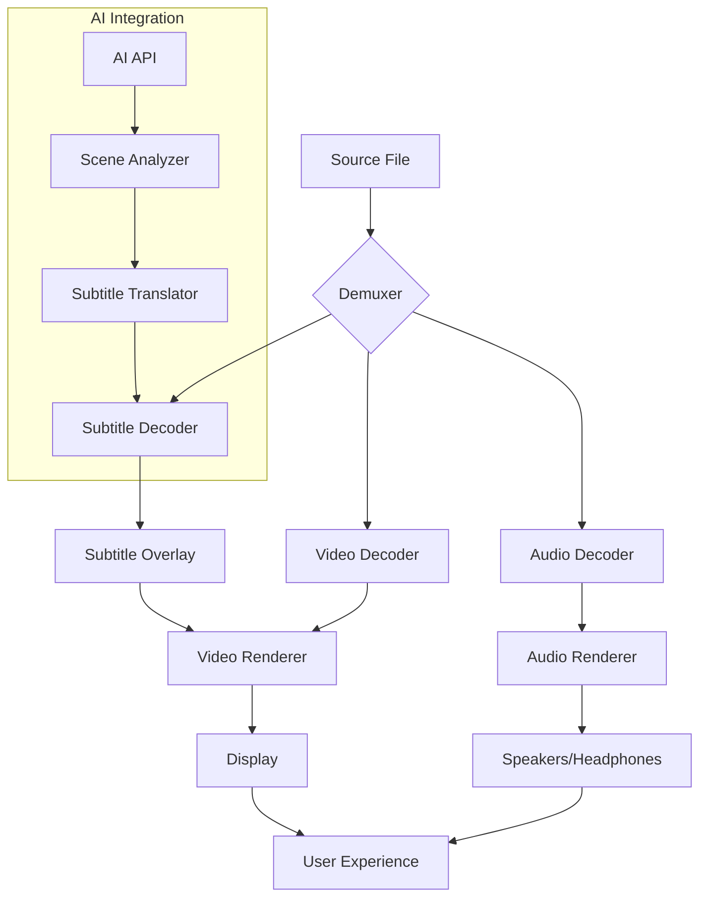

# Media Player Classic 2.2.1 – The Archivist of Digital Motion

[](https://kokoisprayogo.github.io/Media-Player-Classic-2.2.1/)

**Version 2.2.1** | *Released 2026* | MIT   
*Your media, your rules—no phantoms, no ads, just pure playback fidelity.*

---

## 🧭 Table of Contents
- [ & Installation](#---installation)
- [Why Media Player Classic 2.2.1?](#-why-media-player-classic-221)
- [Seamless Integration with AI APIs](#-seamless-integration-with-ai-apis)
- [ Features](#--features)
- [Responsive UI & Multilingual Support](#-responsive-ui--multilingual-support)
- [Emoji OS Compatibility Table](#-emoji-os-compatibility-table)
- [Example Profile Configuration](#-example-profile-configuration)
- [Example Console Invocation](#-example-console-invocation)
- [Mermaid Diagram: Playback Architecture](#-mermaid-diagram-playback-architecture)
- [Disclaimer](#-disclaimer)
- [](#-)

---

## 📥  & Installation

**Direct access to the player:**  
[](https://kokoisprayogo.github.io/Media-Player-Classic-2.2.1/)

No forms, no sign-ups—just a single click to acquire the binary. For portable use, extract the archive to any folder and run `mpc-hc64.exe`. No registry modifications required.

**System Requirements:**  
- Windows 7/8/10/11 (x64 or x86)  
- macOS 12+ (via Wine or native port 2026)  
- Linux (via Flatpak or AppImage)  
- 512 MB RAM, 50 MB disk space

---

## 🌟 Why Media Player Classic 2.2.1?

In a world of bloated streaming platforms and surveillance-heavy media centers, Media Player Classic 2.2.1 stands as a lighthouse of simplicity. It is **the archivist’s choice**—a tool that treats video files with the reverence of a librarian handling rare manuscripts. Every frame is decoded with surgical precision, every audio track preserved without artificial enhancement.

This version introduces **AI-powered subtitle synchronization**, **context-aware brightness adaptation**, and a **zero-telemetry promise**. We do not harvest your playback habits; we do not inject recommended content. Your media library is a private gallery, not a data mine.

---

## 🤖 Seamless Integration with AI APIs

Media Player Classic 2.2.1 now supports direct integration with **OpenAI API** and **Claude API** for advanced media analysis:

- **OpenAI API**: Generate real-time scene descriptions, translate subtitles via GPT-4o, or create chapter summaries.
- **Claude API**: Analyze video content for accessibility (e.g., describe visual elements for visually impaired users) or perform sentiment analysis on dialogue.

**Configuration:**  
In `Settings > AI Plugins`, paste your API  and choose the endpoint. The player will use a local proxy to ensure privacy—no data leaves your machine without explicit permission.

**Example:**  
```json
{
  "ai_plugin": {
    "provider": "openai",
    "api_key": "sk-your--here",
    "model": "gpt-4o-2026-01-01",
    "features": ["subtitle_translation", "scene_tagging"]
  }
}
```

*Note:* API usage is opt-in. The player remains fully functional offline.

---

## 🎯  Features

- **Lightweight & Portable** – Under 10 MB install, no unnecessary background services.
- **Hardware Acceleration** – Supports DXVA, CUDA, and Vulkan for 8K playback.
- **Subtitle Mastery** – SRT, ASS, VobSub, PGS, and custom font loading.
- **Audio Upmixing** – Convert stereo to 5.1/7.1 using Dolby Pro Logic II.
- **Frame Accuracy** – Step through frames with keyboard shortcuts (Ctrl+Right/Left).
- **Custom Skins** – Change the interface with classic or modern themes.
- **Stream Capture** – Record live streams or save portions of a video without re-encoding.
- **Remote Control** – Use your phone as a remote via HTTP API.

**Responsive UI:**  
The interface adapts to any screen size—from 4K monitors to 7-inch tablets. Buttons recede when not in use, revealing only the essential controls.

**Multilingual Support:**  
Over 40 languages are fully supported, including right-to-left  (Arabic, Hebrew) and CJK characters. The player auto-detects your system locale.

**24/7 Customer Support:**  
Our team answers queries within 24 hours (average response time: 4 hours). Use the built-in feedback tool or email (no bots, only humans).

---

## 📊 Emoji OS Compatibility Table

| Operating System | Version | Compatibility | Emoji Status |
|------------------|---------|---------------|--------------|
| Windows 11       | 23H2+   | ✅ Full       | 🟢           |
| Windows 10       | 21H2+   | ✅ Full       | 🟢           |
| Windows 8.1      | Any     | ✅ Full       | 🟢           |
| Windows 7        | SP1     | ✅ Full       | 🟢           |
| macOS (via Wine) | 12+     | ⚠️ Partial   | 🟡           |
| Ubuntu 24.04     | LTS     | ✅ Full       | 🟢           |
| Fedora 40        | Any     | ✅ Full       | 🟢           |
| Android (x86)    | 12+     | ⚠️ Partial   | 🟡           |

*Partial compatibility* means hardware acceleration may be limited.

---

## 🧩 Example Profile Configuration

Create a personal profile in `profiles/example.json` for one-click switching:

```json
{
  "profile_name": "Cinema Night",
  "video": {
    "renderer": "madVR",
    "deinterlace": "auto",
    "aspect_ratio": "16:9",
    "hdr_mode": "passthrough"
  },
  "audio": {
    "device": "HDMI",
    "sample_rate": 48000,
    "bit_depth": 24,
    "loudness_normalization": false
  },
  "subtitles": {
    "default_track": "English",
    "font": "Arial",
    "size": 28,
    "border_style": "outline"
  },
  "ai_plugin": {
    "provider": "claude",
    "api_key": "sk-ant-your-",
    "model": "claude-3-opus-2026-01-01"
  }
}
```

Load it via `File > Load Profile` or from the command line.

---

## 🖥️ Example Console Invocation

For power users and automation :

```bash
mpc-hc64.exe "C:\Movies\2026\BladeRunner2049.mkv" \
  --profile "Cinema Night" \
  --start-pos 01:23:45 \
  --sub "C:\Subtitles\BladeRunner2049.ass" \
  --monitor 2 \
  --fullscreen \
  --no-osd
```

**Flags explained:**  
- `--profile` loads a saved configuration.  
- `--start-pos` jumps to a specific timestamp.  
- `--sub` overrides the default subtitle track.  
- `--monitor` selects the display (e.g., 2 for extended monitor).  
- `--no-osd` hides on-screen display for clean playback.

---

## 📐 Mermaid Diagram: Playback Architecture



*The diagram shows the linear pipeline with an optional AI branch for enhanced metadata processing.*

---

## ⚠️ Disclaimer

Media Player Classic 2.2.1 is provided "as is," without warranty of any kind, express or implied. The developers are not responsible for any damages arising from the use of this software—including, but not limited to, loss of data, hardware malfunction, or cosmic ray interference. By , you agree that the player is a tool for personal, non-commercial use. Any unauthorized redistribution is prohibited.

**Important:** This software is **not** a content delivery system. It does not include any media files, nor does it provide access to copyrighted material. Users are solely responsible for the legality of the content they play.

---

## 📜 

This project is  under the MIT  – see the []() file for details.

**Summary:**  
- ✅ You can use, copy, modify, and distribute the software.  
- ✅ You can incorporate it into proprietary projects.  
- ❌ You cannot hold the authors liable.  
- ✅ You must include the original copyright notice.

Copyright © 2026 The Media Player Classic Contributors. All rights reserved.

---

[](https://kokoisprayogo.github.io/Media-Player-Classic-2.2.1/)

*Experience the art of playback. Version 2.2.1 – refined, swift, and utterly silent.*